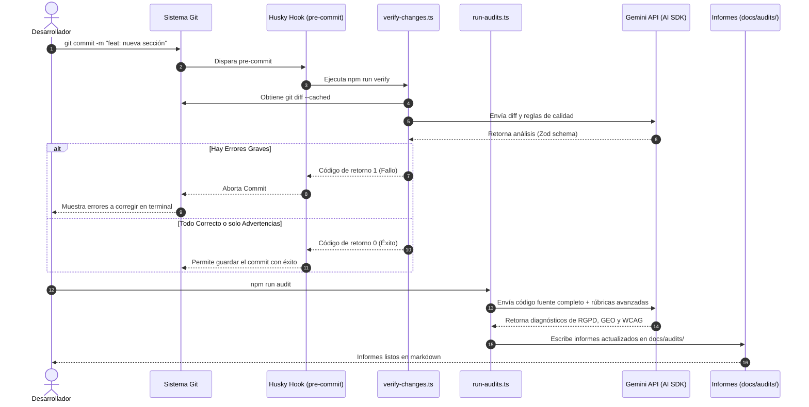

# Arquitectura del Directorio: Automatización e IA (`agents/`)

Este directorio contiene las herramientas de automatización inteligente y aseguramiento de la calidad de **Irina Ichim Studio**. En él reside la lógica que interactúa con la API de Gemini (Vercel AI SDK) para realizar validaciones gramaticales, estructurales, SEO/GEO y de accesibilidad.

---

## 🗺️ Estructura del Directorio

* [verify-changes.ts](file:///c:/Users/proye/.gemini/antigravity/playground/irina-ichim-studio/agents/verify-changes.ts): Script de validación que se ejecuta antes de cada commit de Git (vía Husky). Analiza únicamente las líneas agregadas (diffs) para corregir ortografía, gramática e inconsistencias en SEO/GEO básicas antes de guardar cambios.
* [run-audits.ts](file:///c:/Users/proye/.gemini/antigravity/playground/irina-ichim-studio/agents/run-audits.ts) (nuevo): Agente avanzado que escanea el proyecto entero y genera tres informes markdown especializados sobre Cumplimiento Legal (RGPD/AI Act/ISO), Accesibilidad (WCAG 2.2) y SEO/GEO en la carpeta `docs/audits/`.
* [agent-rules.md](file:///c:/Users/proye/.gemini/antigravity/playground/irina-ichim-studio/agents/agent-rules.md): Reglas de desarrollo y directrices para escribir código e integrar modelos del Vercel AI SDK.

---

## 🔄 Secuencia de Automatización de Calidad (CI/CD Local)

El siguiente diagrama detalla cómo actúan los agentes inteligentes en el ciclo de vida de desarrollo de software:

---

## 🛡️ Registros de Decisión Arquitectónica (ADR)

### ADR-09: Validación con Tipado de Datos Estricto (Zod) sobre Respuestas de IA

* **Contexto**: Las respuestas en texto plano generadas por modelos de lenguaje (LLMs) son variables e inconsistentes, lo que dificulta parsearlas programáticamente en terminales o scripts de compilación sin causar excepciones de ejecución.
* **Decisión**: Se utiliza la función `generateObject` de Vercel AI SDK en combinación con esquemas estrictos de `zod` ([verify-changes.ts](file:///c:/Users/proye/.gemini/antigravity/playground/irina-ichim-studio/agents/verify-changes.ts#L20-L32)).
* **Consecuencias**: Garantizamos que las respuestas de la IA siempre tengan el formato estructurado esperado (booleanos, arrays de problemas tipados, etc.), permitiendo que el script decida de forma robusta si bloquear o permitir el commit de Git.

### ADR-10: Auditorías y Agente Offline-First Local

* **Contexto**: Confiar en la API de Gemini durante los despliegues de producción en la nube (como en Railway o Vercel) introduce riesgos de fallos por límites de cuota (Rate-Limits) o latencias de red externas que tumbarían el despliegue del sitio web.
* **Decisión**: Los scripts del directorio `agents/` se ejecutan exclusivamente en local o en workflows aislados de CI. La compilación del sitio web en producción nunca depende de una llamada de IA en tiempo real.
* **Consecuencias**: Cero impacto en tiempos de compilación de servidores de producción y reducción de costes de APIs, manteniendo la seguridad de la clave `GEMINI_API_KEY` exclusivamente en entornos de desarrollo controlados.
