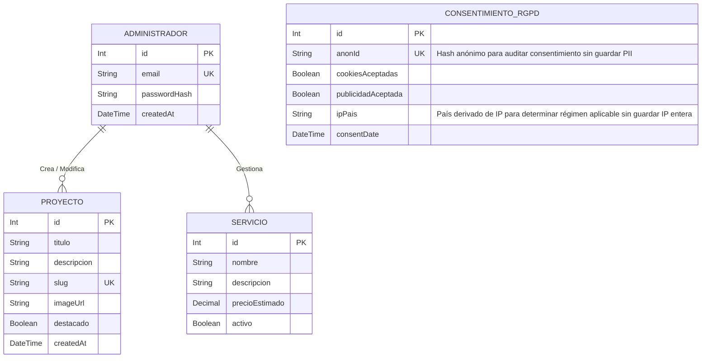

# Arquitectura del Directorio: Base de Datos (`prisma/`)

Este directorio gestiona el modelado físico de la base de datos de **Irina Ichim Studio**, la sincronización de esquemas mediante migraciones de Prisma y las reglas relacionales.

---

## 🗺️ Estructura del Directorio

* [schema.prisma](file:///c:/Users/proye/.gemini/antigravity/playground/irina-ichim-studio/prisma/schema.prisma): Archivo de configuración central de Prisma. Define el generador de cliente (`prisma-client-js`), la fuente de datos PostgreSQL (`DATABASE_URL`) y los modelos lógicos de datos.
* [db-rules.md](file:///c:/Users/proye/.gemini/antigravity/playground/irina-ichim-studio/prisma/db-rules.md): Guía y directrices estrictas para el modelado de datos, políticas de migraciones y restricciones de integridad física.

---

## 🗃️ Modelo Entidad-Relación Conceptual (UML ER)

Para soportar los servicios del estudio (portafolio de proyectos, servicios de diseño, gestión de usuarios, registro de auditorías internas y consentimiento RGPD), se planifica la siguiente estructura relacional:

---

## 🛡️ Registros de Decisión Arquitectónica (ADR)

### ADR-07: Motor Relacional PostgreSQL con Prisma ORM

* **Contexto**: El estudio requiere un almacenamiento robusto con integridad transaccional fuerte (ACID) para consistencia en las reservas de servicios, portafolio y consentimiento RGPD.
* **Decisión**: Se selecciona PostgreSQL como motor relacional primario e Hilos de Conexión administrados vía Prisma ORM.
* **Consecuencias**: El esquema físico se sincroniza de forma automatizada mediante migraciones estructuradas en SQL generadas por Prisma (`npx prisma migrate dev`), lo que garantiza la replicabilidad del entorno de desarrollo a producción.

### ADR-08: Gestión de Consentimiento RGPD sin Guardar PII

* **Contexto**: El Reglamento General de Protección de Datos (RGPD) obliga a poder probar que un usuario otorgó su consentimiento para cookies, pero almacenar direcciones IP completas o nombres de usuarios anónimos viola el principio de minimización de datos.
* **Decisión**: Se modela la tabla `CONSENTIMIENTO_RGPD` generando un hash anónimo (`anonId`) de la sesión/navegador mezclado con una sal del servidor que cambia periódicamente. Se almacena únicamente si el consentimiento fue otorgado, su fecha y el código de país derivado de la IP (ej. "ES") pero NUNCA la dirección IP real.
* **Consecuencias**: Cumplimiento del principio de minimización de datos del RGPD y capacidad de auditoría legal sin almacenamiento de datos personales sensibles (PII).
