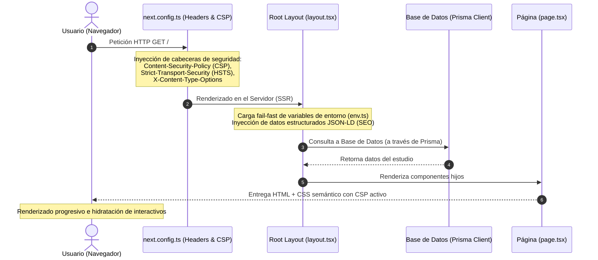

# Arquitectura de la Carpeta: App Router (`src/app/`)

Este directorio contiene la estructura principal de la aplicación web utilizando **Next.js App Router**, gestionando las páginas públicas, layouts globales, cabeceras de seguridad HTTP, y controladores de rastreo para buscadores tradicionales y de IA.

---

## 🗺️ Estructura del Directorio

* [layout.tsx](file:///c:/Users/proye/.gemini/antigravity/playground/irina-ichim-studio/src/app/layout.tsx): Layout raíz que define la estructura HTML básica (`lang="es"`), carga las variables de entorno para fallado rápido, inyecta los metadatos JSON-LD estructurados (datos geográficos/estudio) y establece el estilo básico de Tailwind.
* [page.tsx](file:///c:/Users/proye/.gemini/antigravity/playground/irina-ichim-studio/src/app/page.tsx): Página de inicio (Home) que implementa la landing page del estudio, cumpliendo con criterios estricto de accesibilidad e identidad visual.
* [globals.css](file:///c:/Users/proye/.gemini/antigravity/playground/irina-ichim-studio/src/app/globals.css): Definición de estilos globales usando Tailwind CSS v4, incluyendo la configuración de temas inline y ajustes para contrastes accesibles WCAG AAA y estilos visibles de foco.
* [robots.ts](file:///c:/Users/proye/.gemini/antigravity/playground/irina-ichim-studio/src/app/robots.ts) y [sitemap.ts](file:///c:/Users/proye/.gemini/antigravity/playground/irina-ichim-studio/src/app/sitemap.ts): Generadores dinámicos de rutas de indexación, configurados para habilitar el rastreo de motores de búsqueda convencionales e inteligencias artificiales (GPTBot, ClaudeBot, etc.).

---

## 🔄 Flujo de Peticiones y Renderizado

El siguiente diagrama detalla cómo fluyen las peticiones de usuario a través del sistema, desde la negociación de cabeceras de seguridad hasta el renderizado híbrido de componentes (Server vs Client Components):

---

## 🛡️ Registros de Decisión Arquitectónica (ADR)

### ADR-01: Adopción de Next.js App Router (Híbrido)

* **Contexto**: El estudio de Irina Ichim requiere una landing page extremadamente rápida, indexable por buscadores de IA/tradicionales y accesible.
* **Decisión**: Se implementa Next.js App Router (React 19). La página de inicio y el layout principal se renderizan como **React Server Components (RSC)** por defecto, minimizando el JavaScript enviado al cliente y mejorando el First Contentful Paint (FCP) y el SEO.
* **Consecuencias**: Los interactivos del lado cliente (como animaciones o formularios) se aíslan en subcomponentes con la directiva `"use client"` únicamente en las hojas del árbol del DOM.

### ADR-02: Cabeceras de Seguridad HTTP Estrictas en Configuración

* **Contexto**: Para proteger al usuario final y cumplir con estándares ISO 27001, la aplicación debe mitigar ataques como inyección de código (XSS) y clickjacking.
* **Decisión**: Se configuran cabeceras de seguridad HTTP directamente en [next.config.ts](file:///c:/Users/proye/.gemini/antigravity/playground/irina-ichim-studio/next.config.ts), aplicando:
  * `Content-Security-Policy` estricta (bloqueando recursos de terceros no autorizados).
  * `Strict-Transport-Security (HSTS)` para forzar HTTPS.
  * `X-Content-Type-Options: nosniff`.
  * `X-Frame-Options: SAMEORIGIN` (prevención de clickjacking).
* **Consecuencias**: Cualquier dependencia o recurso externo (ej: scripts de analíticas o APIs) debe registrarse explícitamente en la directiva CSP para evitar bloqueos del navegador.
