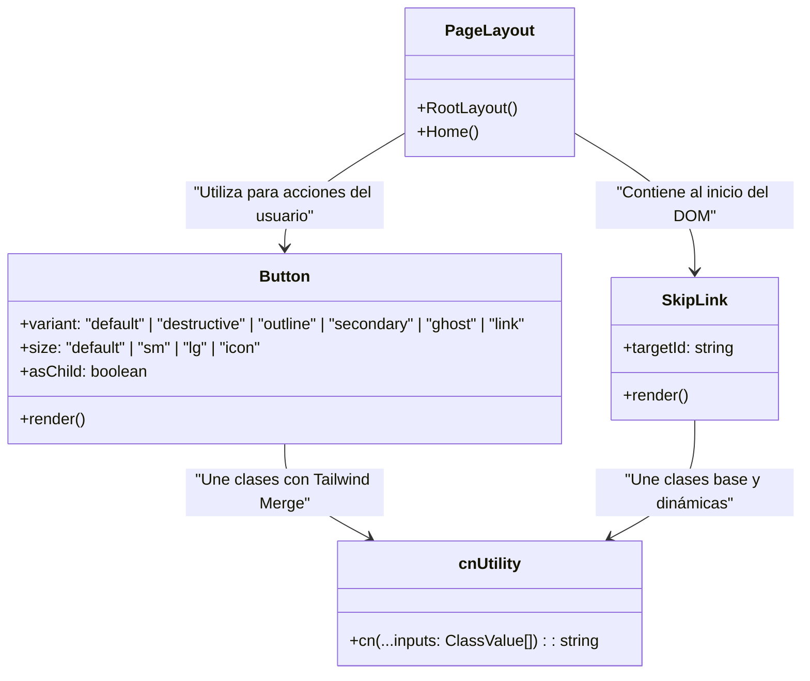

# Arquitectura de la Carpeta: Componentes (`src/components/`)

Este directorio contiene los componentes reutilizables de la interfaz de usuario de **Irina Ichim Studio**. Los componentes se organizan bajo principios de diseño atómico y se diseñan de forma prioritaria para garantizar una excelente accesibilidad (WCAG 2.2 AA/AAA) y modularidad.

---

## 🗺️ Estructura del Directorio

* [ui/](file:///c:/Users/proye/.gemini/antigravity/playground/irina-ichim-studio/src/components/ui/): Colección de componentes de presentación atómicos (botones, enlaces, etc.), configurados para ser totalmente accesibles y estilizados con Tailwind CSS v4.
  * [button.tsx](file:///c:/Users/proye/.gemini/antigravity/playground/irina-ichim-studio/src/components/ui/button.tsx): Componente de botón atómico con variantes semánticas y estilísticas flexibles.
  * [skip-link.tsx](file:///c:/Users/proye/.gemini/antigravity/playground/irina-ichim-studio/src/components/ui/skip-link.tsx): Enlace de salto de accesibilidad por teclado que permite a los lectores de pantalla y navegadores de teclado saltarse el menú de navegación e ir directo al contenido principal.

---

## 📐 Jerarquía de Componentes de Interfaz

El siguiente diagrama de clase Mermaid describe la estructura relacional y cómo se extienden y componen los estilos de presentación de nuestros componentes visuales principales:

---

## ♿ Directrices de Accesibilidad y Foco (WCAG 2.2)

1. **Tamaño de Zonas Interactivas (Touch Targets)**: Todos los botones interactivos e iconos táctiles de `src/components/` deben mantener un tamaño mínimo de **44x44 píxeles** (o al menos 24x24px con un área táctil invisible que compense hasta 44px) para ser operables por personas con dificultades motrices o en dispositivos móviles.
2. **Visibilidad de Foco (focus-visible)**: Todos los componentes interactivos deben definir explícitamente estilos de foco claros con `:focus-visible` (por ejemplo, `outline-2 outline-offset-2 outline-primary`). No se permite la eliminación de las siluetas de foco nativas sin proporcionar un reemplazo claro de alto contraste.
3. **Gestión de Focos Dinámicos (Focus Traps)**: En los menús móviles, modales o diálogos que se añadan al proyecto, se debe encapsular el foco de teclado del usuario usando librerías como `@base-ui/react` o envoltorios personalizados, asegurando que presionar `Tab` no desplace el foco detrás del modal activo.

---

## 🎨 Registros de Decisión Arquitectónica (ADR)

### ADR-03: Modularización de Clases CSS con `clsx` y `tailwind-merge`

* **Contexto**: Al componer clases dinámicas de Tailwind, los conflictos de estilos pueden causar que algunas clases de utilidades sobreescriban a otras de manera impredecible (deuda técnica en cascada CSS).
* **Decisión**: Se implementa la utilidad [utils.ts](file:///c:/Users/proye/.gemini/antigravity/playground/irina-ichim-studio/src/lib/utils.ts) (`cn`), que envuelve `clsx` y `tailwind-merge`.
* **Consecuencias**: Todos los componentes atómicos en `src/components/` combinan sus estilos por defecto y sus propiedades dinámicas mediante la función `cn()`, garantizando que la última clase pasada por propiedad tenga precedencia limpia sobre la definición por defecto.

### ADR-04: Tailwind v4 con Definición de Temas `@theme` Inline

* **Contexto**: Tailwind CSS v4 migra de los archivos JS de configuración hacia una arquitectura nativa en CSS con `@theme`.
* **Decisión**: Se definen los colores primarios, secundarios, bordes y radios del sistema de diseño directamente en [globals.css](file:///c:/Users/proye/.gemini/antigravity/playground/irina-ichim-studio/src/app/globals.css) usando directivas `@theme inline { ... }`.
* **Consecuencias**: Se reduce el tiempo de compilación y se permite que las variables de CSS sean leídas directamente por archivos CSS externos o plugins nativos de CSS del navegador.
