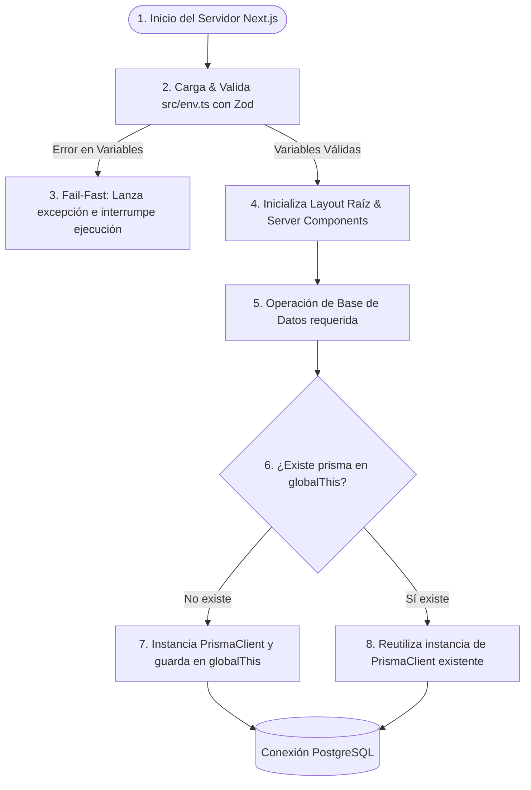

# Arquitectura de la Carpeta: Librerías y Utilidades (`src/lib/`)

Este directorio contiene las integraciones y utilidades de backend y frontend de **Irina Ichim Studio**. En él se implementan servicios fundamentales como la conexión de base de datos a través de un Singleton y la validación estricta de variables de entorno al iniciar la aplicación.

---

## 🗺️ Estructura del Directorio

* [db.ts](file:///c:/Users/proye/.gemini/antigravity/playground/irina-ichim-studio/src/lib/db.ts): Instancia compartida (Singleton) del cliente de base de datos **Prisma Client**, optimizada para el entorno de desarrollo de Next.js.
* [env.ts](file:///c:/Users/proye/.gemini/antigravity/playground/irina-ichim-studio/src/env.ts) (ubicado en `src/env.ts` pero conceptualmente parte de `lib`): Esquema de validación en tiempo de ejecución de las variables de entorno (`.env`) usando Zod.
* [utils.ts](file:///c:/Users/proye/.gemini/antigravity/playground/irina-ichim-studio/src/lib/utils.ts): Utilidades de composición de clases CSS (`cn`) para evitar colisiones en Tailwind v4.

---

## ⚙️ Diagrama de Carga y Conexiones (Singleton & Env Validation)

El siguiente diagrama ilustra el flujo de arranque de la aplicación, detallando el mecanismo fail-fast de variables de entorno y cómo se cachea la conexión de base de datos para optimizar recursos:

---

## 🛡️ Registros de Decisión Arquitectónica (ADR)

### ADR-05: Cliente de Base de Datos como Singleton

* **Contexto**: En modo desarrollo (`npm run dev`), Next.js recarga en caliente (Hot Module Replacement - HMR) los módulos cuando hay cambios. Si instanciamos `new PrismaClient()` directamente, cada recarga creará una nueva conexión a PostgreSQL, agotando rápidamente el pool de conexiones de la base de datos.
* **Decisión**: Se implementa un singleton en [db.ts](file:///c:/Users/proye/.gemini/antigravity/playground/irina-ichim-studio/src/lib/db.ts) que guarda la instancia de Prisma en el objeto global `globalThis` si estamos en desarrollo. En producción, se instancia directamente ya que no hay HMR.
* **Consecuencias**: El pool de conexiones se mantiene constante y controlado en desarrollo, previniendo errores de "too many clients" en PostgreSQL.

### ADR-06: Validación Temprana de Variables de Entorno (Fail-Fast)

* **Contexto**: Un error común y difícil de depurar es arrancar la aplicación sin variables de entorno clave (como `DATABASE_URL` o `GEMINI_API_KEY`), causando fallos silenciosos o crasheos tardíos durante peticiones de usuarios.
* **Decisión**: Se define un esquema de Zod en [env.ts](file:///c:/Users/proye/.gemini/antigravity/playground/irina-ichim-studio/src/env.ts) y se importa en el punto de entrada principal ([layout.tsx](file:///c:/Users/proye/.gemini/antigravity/playground/irina-ichim-studio/src/app/layout.tsx)).
* **Consecuencias**: Si falta una variable de entorno requerida o tiene un tipo incorrecto, la aplicación crasheará inmediatamente al arrancar con un mensaje detallado en los logs, evitando despliegues corruptos en staging o producción.
